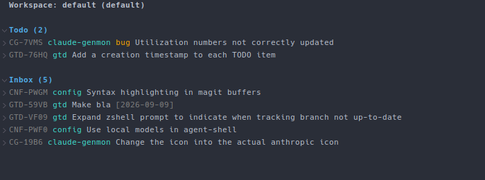

#+TITLE: aven.el

A magit-like Emacs interface to the =aven= CLI task manager: a status
buffer, a per-task buffer, and a transient menu, all built on
=magit-section=.

* Usage

- =M-x aven/status= — open the status buffer
- =M-x aven/dispatch= — transient menu for all commands

Evil bindings are set up automatically when =evil= is loaded, but are
not required.
